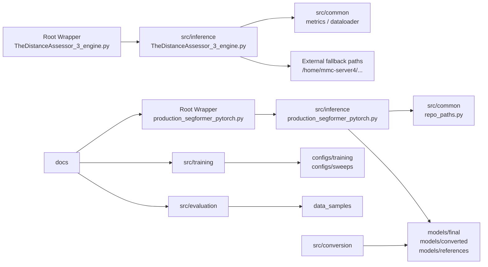
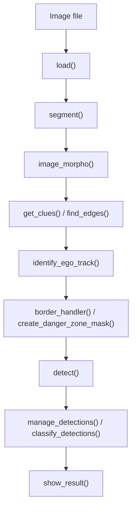

# 소프트웨어 아키텍처 설계 문서

- 문서명: `SW_ARCHITECTURE.md`
- 작성 기준일: `2026-03-19`
- 대상 독자: 회사 제출 검토자, 개발 인수자
- 기준 저장소 범위: `RailSafeNet_LiDAR`
- 문서 목적: 현재 저장소 구조와 실제 실행 흐름을 기준으로 시스템 아키텍처를 설명합니다.

## 1. 시스템 목적

`RailSafeNet_LiDAR`는 철도 환경 영상에서 선로 영역을 분할하고, 필요 시 객체 검출 결과와 결합해 위험 구역을 계산하는 실험/개발 저장소입니다. 현재 저장소는 다음 두 계층으로 이해하는 것이 정확합니다.

- 공식 경로
  - 루트 wrapper `production_segformer_pytorch.py`
  - `src/inference/production_segformer_pytorch.py`
  - 목적: PyTorch 기반 SegFormer smoke path
- 보조 경로
  - `src/inference/`의 ONNX/TensorRT 통합 추론
  - `src/training/`, `src/evaluation/`, `src/conversion/`
  - 목적: 학습, 평가, 변환, 통합 위험도 분석

`ASSUMPTION`: 최종 제출 관점의 기본 실행 경로는 공식 PyTorch smoke path이며, 통합 ONNX/TensorRT 파이프라인은 저장소에 실제 구현되어 있으나 보조 경로로 취급합니다.

## 2. 상위 아키텍처

저장소는 `src/` 중심 구조로 정리되어 있으며, 루트 wrapper가 기존 실행 명령과 `src/` 구현 사이의 연결을 담당합니다.

상위 계층의 책임은 다음과 같습니다.

- `Root Wrapper`
  - 루트 실행 파일을 유지하면서 실제 구현은 `src/`로 위임
- `Inference Layer`
  - PyTorch, ONNX, TensorRT 기반 추론 제공
- `Common Layer`
  - 경로 계산, metrics, dataloader 제공
- `Training / Evaluation / Conversion`
  - 모델 생성, 검증, 형식 변환 담당
- `Assets / Docs`
  - 모델, 샘플 데이터, 문서 제공

## 3. 모듈 구성

| 영역 | 주요 모듈 | 책임 | 비고 |
|---|---|---|---|
| 공식 추론 | `production_segformer_pytorch.py`, `src/inference/production_segformer_pytorch.py` | 모델 탐색, lazy import, PyTorch 모델 로드, smoke path 실행 | 공식 기본 경로 |
| 통합 추론 | `TheDistanceAssessor_3_engine.py`, `TheDistanceAssessor_3.py`, `TheDistanceAssessor_3_onnx.py` | 세그멘테이션, 선로 추정, danger zone 생성, 객체 분류, 시각화 | 보조 경로 |
| 공용 유틸 | `src/common/repo_paths.py`, `src/common/metrics_filtered_cls.py`, `src/common/dataloader_RailSem19.py`, `src/common/dataloader_SegFormer.py` | 경로 유틸, metrics, 데이터 로딩 지원 | 여러 모듈이 공유 |
| 평가 | `src/evaluation/SegFormer_test.py`, `src/evaluation/test_filtered_cls.py`, `src/evaluation/video_frame_tester.py` | 정량 평가, 시각화, 수동 검토 | 자동화 시험 프레임워크와는 별도 |
| 학습 | `src/training/train_SegFormer.py`, `src/training/train_SegFormer_transfer_learning.py`, `src/training/train_DeepLabv3.py`, `src/training/train_yolo.py`, `src/training/sweep_transfer.py` | 학습, 전이학습, sweep | 외부 데이터/모델 의존성 존재 |
| 변환 | `src/conversion/original_to_onnx.py`, `src/conversion/yolo_original_to_onnx.py`, `src/conversion/onnx_to_engine.py`, `src/conversion/yolo_onnx_to_engine.py` | ONNX export, TensorRT engine 생성 | 대상 GPU 제약 존재 |

## 4. 데이터 흐름

### 4.1 공식 PyTorch smoke path

공식 경로는 전체 서비스 파이프라인이 아니라, “모델 로드와 최소 추론 가능 여부”를 확인하는 smoke path입니다.

1. CLI 인자 수집
2. 모델 후보 경로 탐색
3. 런타임 의존성 lazy import
4. PyTorch SegFormer 로드
5. 더미 입력 생성
6. `logits.shape` 출력

### 4.2 통합 위험도 추론 path

보조 경로는 실제 이미지 기반 위험도 분석 흐름을 포함합니다.

1. 이미지 로드
2. 세그멘테이션 수행
3. morphology 후처리
4. 선로 후보 탐색
5. ego track 식별
6. danger zone 생성
7. YOLO 객체 검출
8. 위험도 분류
9. 시각화 출력

## 5. 런타임 실행 흐름

### 5.1 공식 경로

- 사용자는 루트 `production_segformer_pytorch.py`를 실행합니다.
- 루트 wrapper는 `_root_wrapper.py`를 통해 `src.inference.production_segformer_pytorch`를 실행하거나 public symbol을 노출합니다.
- 결과적으로 루트 명령은 유지되면서 실제 구현은 `src/` 아래에 집중됩니다.

### 5.2 보조 경로

- `TheDistanceAssessor_3_engine.py` 루트 wrapper는 `src.inference.TheDistanceAssessor_3_engine`로 위임합니다.
- 같은 방식으로 `TheDistanceAssessor_3.py`, `TheDistanceAssessor_3_onnx.py`도 보조 추론 경로를 제공합니다.

### 5.3 ONNX/TensorRT 경로

- ONNX 경로는 ONNX Runtime provider 선택 후 세션 기반 추론을 수행합니다.
- TensorRT 경로는 엔진 deserialize, buffer allocation, CUDA stream 기반 추론을 수행합니다.
- 이들 경로는 저장소에 구현되어 있으나, 현재 제출 기준에서는 보조 경로입니다.

## 6. 모델 로딩 및 추론 흐름

### 6.1 공식 PyTorch 경로의 모델 탐색 순서

공식 PyTorch 경로는 아래 순서로 SegFormer `.pth`를 찾습니다.

1. `--model-path`
2. `models/final/segformer_b3_production_optimized_rail_0.7500.pth`
3. `models/final/SegFormer_B3_1024_finetuned.pth`
4. `models/converted/SegFormer_B3_1024_finetuned.pth`
5. 기존 `/home/mmc-server4/...` fallback 경로

현재 저장소에는 `models/converted/SegFormer_B3_1024_finetuned.pth`가 실제로 존재합니다.

### 6.2 포함된 ONNX/TensorRT 아티팩트

- ONNX: `models/converted/segformer_b3_original_13class.onnx`
- TensorRT: `models/final/segformer_b3_original_13class.engine`

이 두 파일은 저장소에 실제 존재하지만, 생성 환경은 현재 Windows workspace와 다릅니다.

### 6.3 TensorRT 엔진 해석

- 사용자 제공 정보 기준으로 현재 포함된 `.engine` 파일은 Linux + Titan RTX 기준 산출물입니다.
- 따라서 “파일 존재”와 “현재 환경에서 즉시 실행 가능”은 분리해서 봐야 합니다.
- `TODO`: 실제 배포 대상이 `Orin NX`라면 대상 장비에서 재생성 또는 재검증이 필요합니다.

## 7. 시각화 및 출력 흐름

경로별 출력 성격은 다음과 같이 다릅니다.

- 공식 PyTorch smoke path
  - 주요 출력: 콘솔 로그, `logits.shape`
  - 기본 화면 시각화는 수행하지 않음
- 통합 위험도 경로
  - `show_result()`를 통해 danger zone overlay, detection box, 색상 기반 위험도 시각화 수행
- 평가 경로
  - 지표, 샘플 이미지, 프레임 단위 검토 결과 생성 가능

`ASSUMPTION`: 통합 위험도 경로와 일부 평가 스크립트는 interactive visualization 전제를 가지므로 headless 환경에서는 별도 조정이 필요할 수 있습니다.

## 8. 배포 구조

현재 저장소 기준 배포 구조는 다음과 같습니다.

- 소스 코드: `src/`
- 루트 실행 호환 계층: 루트 wrapper, `_root_wrapper.py`
- 설정: `configs/`
- 모델:
  - `models/final/`
  - `models/converted/`
  - `models/references/`
- 샘플 데이터: `data_samples/`
- 환경 파일: `requirements.txt`, `requirements/`, `environment.yml`
- 문서: `docs/`

배포 구조 관련 주의사항:

- Docker 파일은 현재 제공되지 않습니다.
- TensorRT 엔진은 대상 GPU, TensorRT, CUDA 조합에 맞춰 생성해야 합니다.
- 문서상 우선 지원 환경은 `Linux + Nvidia Orin NX`로 정리되어 있으나, 현재 포함된 `.engine` 파일은 Titan RTX 기준 산출물입니다.

## 9. 한계 및 기술 부채

- `ASSUMPTION`: 현재 Windows workspace는 문서/검토 workspace이며, 원래 학습/변환이 수행된 Linux 환경과 다릅니다.
- 포함된 TensorRT 엔진은 Titan RTX 기준 산출물이라 대상 GPU 이식성이 보장되지 않습니다.
- 통합 YOLO 경로는 `yolov8s` 외부 자산 참조와 `yolov8n.pt` 실파일이 혼재합니다.
- 일부 코드에는 `/home/mmc-server4/...` fallback 경로가 남아 있습니다.
- `TODO`: 클래스 ID `4`, `9`, `1`의 최종 의미 근거는 별도 문서화가 필요합니다.
- `TODO`: danger zone 거리값 `100/400/1000`의 도메인 기준은 저장소만으로 확정할 수 없습니다.
- ONNX/TensorRT 경로는 코드와 파일이 존재하지만, 현재 Windows workspace 기준 재검증 결과는 없습니다.
