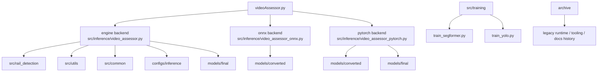
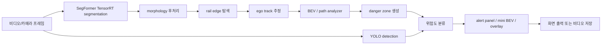

# 소프트웨어 아키텍처 설계 문서

- 문서명: `SW_ARCHITECTURE.md`
- 작성 기준일: `2026-03-19`
- 대상 독자: 회사 제출 검토자, 개발 인수자
- 기준 저장소: `RailSafeNet_LiDAR`

## 1. 시스템 목적

본 시스템의 목적은 철도/트램 전방 영상을 기반으로 선로 위치를 추정하고, 위험 구역을 생성하며,
객체 검출 결과와 결합해 운행 위험도를 시각화하는 것이다. 현재 저장소는 회사 제출용으로 최소화된
구조를 사용하며, 최종 사용자 관점의 단일 진입점은 `videoAssessor.py`다.

## 2. 상위 아키텍처

현재 active tree의 핵심 아키텍처는 아래와 같다.

핵심 원칙:

- 사용자-facing entry는 `videoAssessor.py` 하나로 통일한다.
- `engine` backend를 canonical runtime으로 둔다.
- `onnx`, `pytorch` backend는 현재 preflight 중심 보조 경로로 유지한다.
- 과거 `TheDistanceAssessor*`와 변환/평가/과정 문서는 `archive/`로 이동한다.

## 3. 모듈 구성

| 영역 | 주요 모듈 | 책임 | 비고 |
|---|---|---|---|
| root entry | `videoAssessor.py` | 사용자 CLI, backend 선택, engine preflight | 단일 사용자 진입점 |
| canonical runtime | `src/inference/video_assessor.py` | 비디오/카메라 처리, 모델 로드, 위험도 추론, 시각화 | `001-what-why-home` 기반 최신화 |
| helper | `src/inference/video_assessor_helpers.py` | rail edge/track helper 함수 | `videoAssessor` helper 통합 |
| backend preflight | `src/inference/video_assessor_onnx.py`, `src/inference/video_assessor_pytorch.py` | ONNX/PyTorch dependency 및 모델 상태 점검 | 전체 runtime 미통합 |
| rail logic | `src/rail_detection/*` | BEV, danger zone, rail tracking, alert panel, mini BEV | 001 branch runtime 지원 모듈 |
| shared util | `src/utils/*`, `src/common/*` | geometry, config, data model, dataset, morphology 등 | runtime/training 공용 |
| training | `src/training/train_segformer.py`, `src/training/train_yolo.py` | 최종 유지 학습 엔트리 | active training 2개만 유지 |
| archive | `archive/*` | legacy runtime, conversion, evaluation, docs history | 사용자 active 경로 아님 |

## 4. 데이터 흐름

### 4.1 canonical engine runtime

### 4.2 보조 backend

- `onnx`: SegFormer `.onnx` 및 dependency 상태 점검
- `pytorch`: SegFormer `.pth`, YOLO `.pt`, `transformers` 상태 점검

현재 이 두 backend는 전체 video pipeline이 아니라 preflight 중심 역할만 가진다.

## 5. 런타임 실행 흐름

1. 사용자가 `videoAssessor.py`를 실행한다.
2. CLI parser가 backend와 실행 모드를 해석한다.
3. `--check-only`인 경우:
   - `engine`: root에서 dependency와 모델 상태만 점검
   - `onnx`, `pytorch`: 각 backend 모듈의 preflight 실행
4. 실제 runtime인 경우:
   - 현재 active는 `engine`만 지원
   - `src/inference/video_assessor.py`가 모델을 로드하고 `FinalProcessor`를 초기화한다.
5. 비디오/카메라 프레임 단위로 처리 후 시각화 결과를 화면 또는 파일로 출력한다.

## 6. 모델 로딩 및 추론 흐름

### 6.1 engine backend

- SegFormer:
  - 기본 경로: `models/final/segformer_b3_original_13class.engine`
- YOLO:
  - 우선 후보: `models/final/yolov8n.engine`, `models/final/yolov8s.engine`
  - fallback: `models/final/yolov8n.pt`, `models/final/yolov8s.pt`

실행 제약:

- 현재 repo에는 YOLO `.engine`가 없다.
- 따라서 engine backend는 현재 상태상 YOLO `.pt` fallback 사용 가능성을 포함한다.
- 포함된 SegFormer `.engine`는 Titan RTX/Linux 기준 산출물이므로 대상 GPU에서 재검증이 필요하다.

### 6.2 onnx backend

- SegFormer `.onnx`: `models/converted/segformer_b3_original_13class.onnx`
- YOLO `.onnx`: 현재 active repo 기준 없음

### 6.3 pytorch backend

- SegFormer `.pth`: `models/converted/SegFormer_B3_1024_finetuned.pth`
- YOLO `.pt`: `models/final/yolov8n.pt`
- `transformers`가 필요하다.

## 7. 시각화 및 출력 흐름

canonical runtime의 주요 출력은 아래와 같다.

- 원본 프레임 위 danger zone overlay
- 검출 박스 및 위험도 표시
- alert panel
- mini BEV
- FPS 및 상태 정보
- 필요 시 결과 비디오 저장

현재 `engine` backend는 interactive visualization 중심이며, headless 환경에서는 별도 출력 전략이 필요할 수 있다.

## 8. 배포 구조

현재 저장소 기준 배포 구조:

- 실행 진입점: `videoAssessor.py`
- runtime 코드: `src/inference`, `src/rail_detection`, `src/utils`, `src/common`
- 설정: `configs/inference`
- 모델: `models/final`, `models/converted`, `models/references`
- 문서: `docs/`
- 학습 엔트리: `src/training`
- archive 참고 자산: `archive/`

Docker:

- 현재 active main에는 Docker 기반 배포 구성이 포함되지 않는다.
- `001-what-why-home`의 Jetson/Docker 자산은 reference-only로 간주한다.

## 9. 한계 및 기술 부채

- `engine` backend는 canonical runtime이지만 현재 Windows workspace에서는 dependency가 부족하다.
- `onnx`, `pytorch` backend는 전체 pipeline이 아니라 preflight 수준만 active다.
- 포함된 SegFormer TensorRT engine은 Titan RTX/Linux 기준 산출물이다.
- active YOLO `.engine`와 YOLO `.onnx` 아티팩트는 현재 repo에 없다.
- 일부 training 스크립트 기본 경로는 과거 Linux 학습 환경 절대경로를 유지한다.
- `archive/`에는 여전히 참고 가치가 높은 과거 runtime과 tooling이 있으므로 완전한 코드 단일화는 아직 끝나지 않았다.
- `ASSUMPTION`: `001-what-why-home`의 `videoAssessor_final.py`가 최신 runtime 기준이라는 전제 아래 현재 구조를 정리했다.
